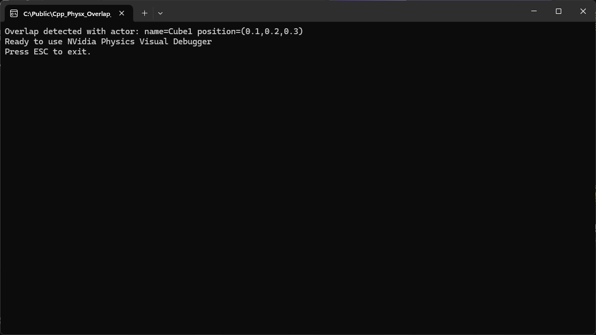

# Overview

This sample project is a Windows C++ Console App that demonstrates using PhysX to do an overlap query with boxes.

```c++
// The code creates a static cube and performs an overlap query with a box geometry.
// The code prints the names of the overlapping actors if any overlap is detected.
// The code can be used as a reference to perform overlap queries in PhysX.
```

# Screenshot



# References

* Tutorial YouTube: [How To Implement Nvidia Physx API into your C++ Project | Init, Base Scene, and PVD Debugger](https://www.youtube.com/watch?v=zOYpVAoQFyU)

* [https://github.com/codetechandtutorials/PhysX-Setup](https://github.com/codetechandtutorials/PhysX-Setup)

# Code Snippets

**Include the PhysX API**

```c++
#include <PxPhysicsAPI.h>
```

**Create a static cube actor**

```c++
physx::PxRigidStatic* createStaticCube(physx::PxPhysics* physics, const physx::PxTransform& transform, const physx::PxVec3& dimensions) {
    physx::PxShape* shape = physics->createShape(physx::PxBoxGeometry(dimensions), *physics->createMaterial(0.5f, 0.5f, 0.6f));
    if (shape)
    {
        physx::PxRigidStatic* actor = physics->createRigidStatic(transform);
        if (actor)
        {
            actor->attachShape(*shape);
        }
        shape->release();
        return actor;
    }
    return nullptr;
}
```

**Create a static cube and add to the scene**

```c++
    // position of the cube
    physx::PxVec3 position1(0.1f, 0.2f, 0.3f);
    // rotation of the cube using euler degrees
    physx::PxQuat rotation1(eulerAnglesToQuaternion(45, 0, 0));
    // use a transform with position and rotation
    physx::PxTransform transform1(position1, rotation1);
    // create the static cube actor
    physx::PxRigidStatic* cube1 = createStaticCube(mPhysics, transform1, physx::PxVec3(1.0f, 1.0f, 1.0f));
    // name the cube for the overlap event message
    cube1->setName("Cube1");
    // add the actor to the scene
    mScene->addActor(*cube1);
```

**Do an overlap test to intersect with the cube**

```c++
    // Create a box geometry for overlap query
    physx::PxBoxGeometry overlapBoxGeometry(physx::PxVec3(2.0f, 2.0f, 2.0f)); // Adjust dimensions as needed

    // Create a transform for the overlap region (position and orientation)
    physx::PxVec3 position2(0.5f, 0.6f, 0.7f);
    physx::PxQuat rotation2(eulerAnglesToQuaternion(-45, 0, 0)); // degrees
    physx::PxTransform transform2(position2, rotation2);

    // Create a buffer to store the overlap results
    physx::PxOverlapHit hitBuffer[10]; // Adjust the buffer size as needed

    // Perform the overlap query
    physx::PxOverlapBuffer overlapResults(hitBuffer, 10); // Pass the buffer to the overlap query
    bool overlapStatus = mScene->overlap(overlapBoxGeometry, transform2, overlapResults);

    if (overlapStatus) {
        // Handle the overlapping objects (e.g., print their names or perform other actions)
        for (PxU32 i = 0; i < overlapResults.nbTouches; ++i) {
            const PxOverlapHit& hit = overlapResults.touches[i];
            PxRigidActor* overlappingActor = hit.actor;
            if (overlappingActor)
            {
                std::cout << "Overlap detected with actor:"
                    << " name=" << overlappingActor->getName()
                    << " position=(" << overlappingActor->getGlobalPose().p.x
                    << "," << overlappingActor->getGlobalPose().p.y
                    << "," << overlappingActor->getGlobalPose().p.z
                    << ")" << std::endl;
            }
            else
            {
                std::cout << "Overlap detected with null actor" << std::endl;
            }
        }
    }
    else {
        std::cout << "No overlap detected." << std::endl;
    }
```
